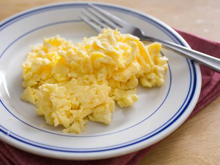
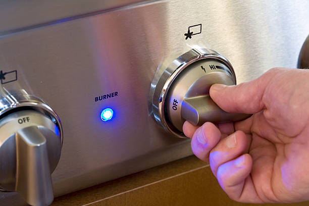
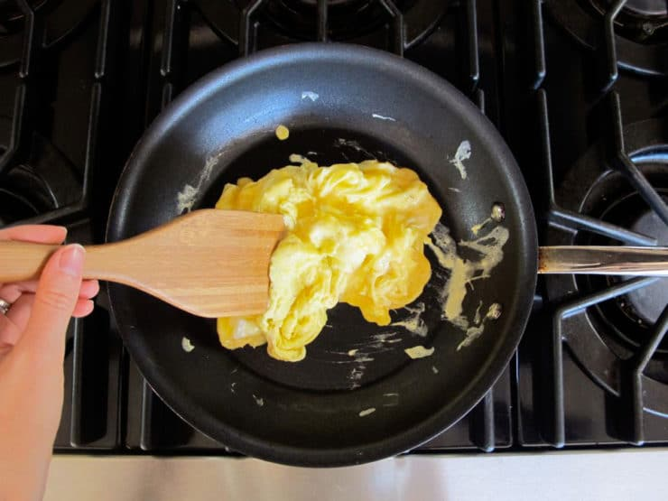

# How to Scramble Eggs
## _Using a Home Recipe_

Scrambling eggs is a very common and easy way to prepare eggs, and it involves either stirring, beating, or whipping eggs together while heating them until they solidify. Oftentimes, other ingredients such as butter, salt, pepper, etc. are added for flavor. In this how-to, I will explain the scrambing process using my own recipe, which will reasonably serve two.

## What You'll Need:

- A stovetop
- A pan or skillet, preferrably non-stick
- A spatula, do not use metal on a non-stick pan
- A small mixing bowl
- 6 eggs
- 1 tbs butter
- 1/4 cup of milk
- 1/2 cup cheese
- Salt and pepper

## Preparation steps:

I Like the start with the stove preparation, as it allows for the pan to heat up before we start the cooking process. 
1. Light the stovetop burner and set it to medium heat.
2. Put your pan on the burner.
3. Drop the tablespoon of butter into the pan.

With the stovetop prepared and the butter melting, we can start on the eggs.

4. Crack the eggs one by one on the edge of the mixing bowl and pour them in, being careful to keep any shell bits from falling in.
5. Whisk the eggs until the yolks are broken up and mixed together with the egg whites.
6. Pour the 1/4 cup of milk into the bowl and gently stir it into the mixture.

Now that the eggs are mixed and ready, it is time to start cooking! 

## Cooking steps:

At this point, the butter in the pan should be melted. The butter will help keep the eggs from sticking to the pan during and after the cooking process. 

1. Pick up the pan and move it around so that the melted butter covers the bottom as best as possible.
2. Slowly pour the egg and milk mixture into the pan.
3. Add the half cup of cheese into the pan.
4. Stir the contents of the pan with the spatula.

Once the contents of the pan are stirred and mixed thoroughly, you will want to continue to stir the eggs and push them towards the center of the pan. The eggs will start to cook as soon as they go into the pan, so it is important to continue to stir and move them around in order to cook them evenly. The eggs should be down in about 3-5 minutes, or when they get firm and solidify. 

### Post cooking:

Ta da! Perfectly scrambled eggs. But we're not done just yet. Once the eggs are done you'll want to:

1. Remove the pan from the burner.
2. Turn the burner off.

Safety first! It is extremely dangerous to leave a gas burner on.

3. Add salt and pepper to the scrambled eggs to taste.

And that's it, hope you enjoyed.

